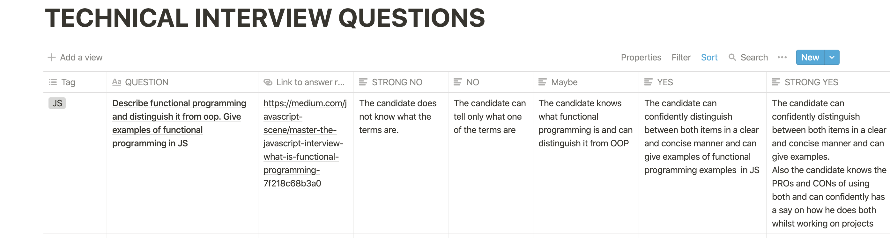

A **Frontend Engineer** is responsible for the implementation of the visual interface a user sees and interacts with on a web page, using primary tools like  **HTML**, **CSS** and **JavaScript**.

Lately, there's been a growing need for hiring experienced frontend engineers and most firms albeit with solid engineering teams, seem to have a deficient hiring process for their Frontend Engineers.

The problem usually stem from these firms trying to model the hiring process to imitate that of traditional software engineers.

In this lengthy post, I'll be explaining my process of hiring frontend engineers the right way!

### Clear Definition of Role and Responsibility
The first thing to do is to have an in-depth conversation with the recruiting team and the engineering manager on the role and basic responsibilities the new intake would have. This enables you to write a near-perfect Job description that clearly states what requirements the new intakes would have.

To a large extent, this also streamlines the interview process to primarily validating the candidate against the job description requirements.

### Job Description
The first step in marketing your position is having an attractive and **correct** job description. Most qualified candidates can tell if they want to work with you by just reading the Job description.

It is also essential to make sure your description is correct. Having non-frontend essential requirements as part of the description usually come on as a turn off to most candidates.
This may make the candidates feel you do not have a clear understanding of what you're searching for.

Another thing that I've found to be helpful to applicants is stating your entire recruitment/interview process on the job description. Most candidates tend to tailor their resume or cover letter to match each company they apply for. This takes time to accomplish therefore it is usually helpful if they know what steps are in the recruitment process to analyze their availability.

It's always adviced to keep your Job description short and simple. An example is [this](https://www.linkedin.com/jobs/view/1803026313/) from Netflix.

### Resume Filtering
The next step is to filter the candidate resumes. I particularly enjoy short and detailed cover letters. With a candidate's cover letter, I usually can tell how confident they are about their abilities and the enthusiasm they have for that particular role and firm.

The candidate's experience level (with respect to the role), how similar their previous roles and tech stack is to the one you're offering, their recommendations, their projects and their contribution to open source are all metrics that you **may** or **may not** consider, depending on your firm's preferences.

### The Process
After résumé review, the interview process is split to **three stages** :
1. Phone Interview
2. Coding Test
3. Physical or Remote Meeting

### 1. Phone Interview
The first step of the interview proper is usually the phone interview stage. Because a lot of the candidates have day time jobs, I usually prefer doing this at night or in the early morning.

The candidate and I usually decide on a time they feel comfortable with and I allow candidates an opportunity to reschedule only once.

The phone interview stage is used primarily to see how clearly the candidate can communicate what they know, the knowledge depth of their craft, learn about the candidate and quantify his interest in the position.

The total time for the phone interview should be 45 minutes to 1 hour.

1. Introduce yourself, Describe the firm and describe the role your'e interviewing for.  **2-3 minutes**
2. Candidate introduces themselves, tell us about their passion, their previous experiences and why they think the role is perfect for them. **5 - 7 minutes**
3. Ask [predefined questions](#predefined-questions). **30 minutes**
4. Candidates time to ask questions about the firm and the recruitment process. **5 - 10 minutes**

### Predefined Questions
A major challenge we face is deciding what kind of questions to ask the candidates.

Do we just google "frontend engineer interview questions" and ask away?

How do we grade them?

How do we decide their level based off those questions?

To do this, we create a chart with questions and different answers for different levels.

In the example above, Notion was used to create the chart. 

Questions are first divided into tags. I've found the following basic tags a pre-requisite for mid-level to senior frontend engineers:

1. HTML
2. CSS
3. Web Accessibility
4. DOM
5. JavaScript
6. Basic Algorithms and DS
7. Module Bundlers (e.g Webpack)
8. A Frontend Framework
9. Writing tests
10. Miscellaneous ( SSR, Web Sockets and Service Workers )

You should ask at least 1-2 questions under each of tags.

The average answer bracket a candidate falls in should give a rough estimate of their experience level.

### 2. Coding Test
Candidates that scale through the phone interview should take a given a code test. This test should be something that can be completed ideally in 60 - 90 minutes. However, I usually give candidates 48 hours. This is because of unforeseen circumstances that the candidate might face.

To design a sample code test, the first step is to pick out the relevant niches you want to test for, then use them to form a real life question.

An example set of niches could be:

1. HTML semantics
2. UI Responsiveness
3. Code architecture (Modularity)
4. Tests
5. Documentation

I also advice avoiding **scope creep** in the code test by clearly stating expectations around your project. This gives the candidate a clear boundary to work within.

### 3. Physical or Remote Meeting
The final interview stage is a physical or remote meeting with the team the candidate would be working with. This stage is usually divided into 3 stages.
1. **System Design**:
	Here the candidate with one or two team members talks about a system design problem. An example could be picking a popular website known to both parties and discussing how they would build that website from scratch.
2. **Pair Programming**: The candidate basically works through a real-life problem with an engineer in the team.

3. **Code Review**: The candidate reviews code written by other members of the team and other members review his code in his presence. This is particularly relevant in understanding how well the candidate can give constructive feedback, show empathy and receive feedback.

### Conclusion
At the end of the 3rd stage, you should know if you want to hire the candidate or not. It is essential that you analyze all stages in your recruitment process and eliminate bias wherever found.