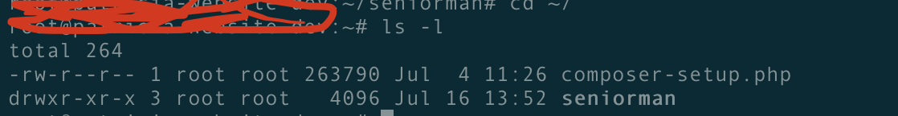

## Linux File Permissions  
Running the `ls -l` command on your terminal shows a similar output like so:

This output forms the very basis of permissions(mode) for files and directories.

<!-- 
`drwxr-xr-x 3 root root   4096 Jul 16 13:52 seniorman` -->

## Read. Write. Execute.
Three characters that we'll be seeing a lot are `r`, `w` and `x` which mean read, write and execute permissions respectively. Whenever we refer to permissions, we'd be using the combination of these three letters to describe it. 

#### Some Examples 
* `rwx` means Read, Write and Execute permissions are granted on the resource.
* `r-x` means Read and Execute permissions.
* `-w-` means only Write permission. 

From the earlier output, we inspect `drwxr-xr-x`. This is divided into 4 parts
1. The type of resource; `-` for a file, `l` for a symbolic link and `d` for a directory. Here it's a directory.
2. The permissions for the user (owner of the file). `rwx`:  Read, Write and Execute.
3. The permissions for members of the file's group. `r-x`: Read and Execute.
4. The permissions available to all users. `r-x`: Read and Execute.

Note that order of the output would always be like this.

## Changing Permissions
Permissions are also called modes. Hence the command used for changing permissions is called `chmod` which is short for **change mode**.

The format for changing permissions is:

`chmod mode file`
 
There are two notations for specifying the mode:
1.  Symbolic Notation
2.  Numeric Notation

### Symbolic Notation
To set permissions using symbolic notation, run:

`chmod usercategoryOperatorPermission file`
* User Category: The category which permissions are to be altered. The options include:
    1. `u` : user
    2. `g` : group
    3. `o` : other
    4. `a` : all
* Operator: Used to alter permissions: They include:
    1. + : Add permission
    2. - : Remove permission
    3. = : Set permission
* Permission: The permissions. `rwx`

#### Examples  

|  Example | Description  |
|---|---|
|  `chmod g+w dummy.txt`  |   Add write permission to the files group |
|  `chmod u-wr dummy.txt`  | Remove write and read for user  |
|  `chmod u+rwx,g-w dummy.txt`  | Add all for user and remove write for group  |
|  `chmod a=wr dummy.txt`  | Set all to write and read only  |
|  `chmod u=rwx,o=  dummy.txt`  | Set user to rwx and set others to ---  |

The Next post will be on Numeric Notation. Please reach out to me for corrections and questions on twitter.