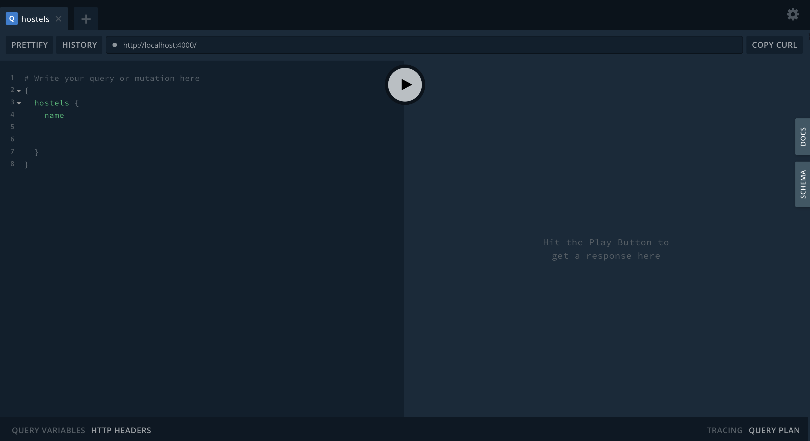

## Introduction
Wikipedia defines pagination as the process of dividing a document into discrete pages, either electronic pages or printed pages.

In Software engineering, pagination allows us query data by a certain length and also by sections. 

There are two primary types of GraphQL pagination styles we'd be discussing:
1. Offset Pagination
2. Cursor Pagination

## Setting up Environment
To follow this tutorial, clone the git repository at https://github.com/felixiho/paginationExample.

Checkout to branch step1 by doing `git checkout step1` and run `npm install`.

To start the server, run `nodemon index`

Go to https://localhost:4000 and you'll see something like this

## Offset Pagination

