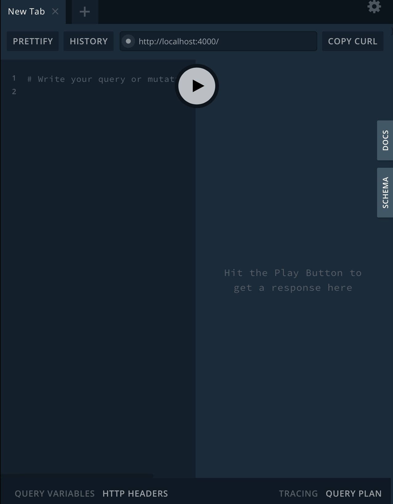
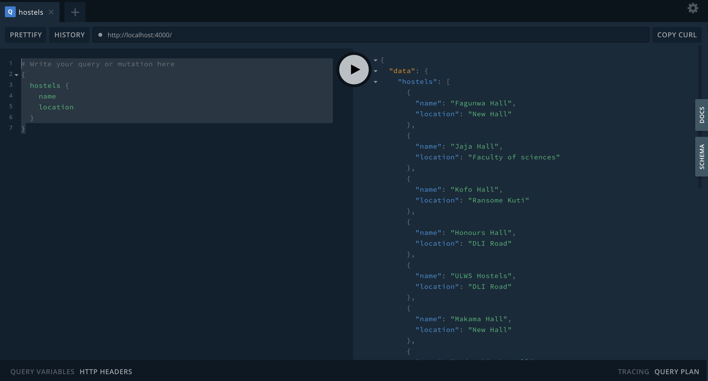

## Introduction
Wikipedia defines pagination as the process of dividing a document into discrete pages, either electronic pages or printed pages.

In Software engineering, pagination allows us query data by a certain length and also by sections. 

There are two primary types of GraphQL pagination styles we'd be discussing:
1. Offset Pagination
2. Cursor Pagination

## Setting up Environment
To follow this tutorial, clone the git repository at https://github.com/felixiho/paginationExample.

Checkout to branch step1 by doing `git checkout step1` and run `npm install`.

To start the server, run `nodemon index`

Go to https://localhost:4000 and you'll see something like this



Copy and paste this inside the console and click on the play button.

```javascript
{
  hostels{
    name
    location
  }
}
```

The response should look like this.



Next, we'll talk about implementing pagination on this response.

## Offset Pagination
In offset pagination, we specify two parameters in our query; **first** and **offset**.

**first** is an integer specifying the number of results you'd like to get. 

**offset** is an interger that specifies the number of results you'd skip before invoking **first**.

To implement this on our server, we update our hostels query type to

```javascript
type Query {
    hostels (first: Int, offset: Int): [Hostel]
  }
```

We also need to update the hostels resolvers to use the new arguments now being passed to it.

```javascript
const resolvers = {
  Query: {
    hostels:  (root, args) => {
      const {first, offset} = args; 
      const result =  offset === undefined ?
                        hostels.splice(0, first)
                          : hostels.splice(offset, first);
      return result;
    },
  },
}; 
```

To see the results, we modify the initial query like this before clicking on play.


```javascript
{
  hostels(first: 4, offset: 2){
    name
    location
  }
}
```

This skips the first two and returns the next 4 items.

To see the completed code, checkout to branch step2.

  `git checkout step2`.

Offset pagination albeit easy to implement, might skip some results in scenerios where new entries are added to the database during the query.

This is where cursor pagination outshines it.

## Cursor Pagination 
In cursor pagination, we specify a 'cursor' that tells the server where to start getting data from. A new cursor variable is returned everytime the server responds to your query. This cursor variable is then passed to the next query. Note that we can still pass a limit as a variable.


A cursor can be any variable from a timestamp to an Id. Nonetheless, timestamps are preferred because it solves our problem of new data being added or existing data being deleted during our query processes as seen in offset pagination. 

First, We update our query to include the `createdAt` field.

```javascript
{
  hostels(first: 4) {
    name
    location
    createdAt
  }
}

```

The response now contains the date which each item was created. Next we write the resolver.
